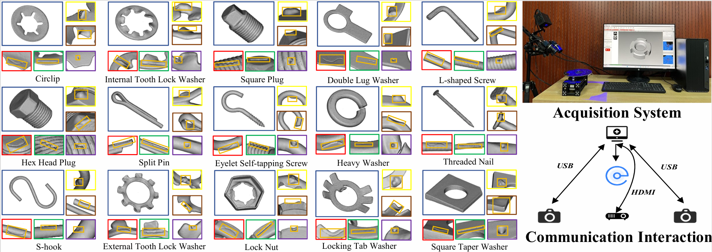

# Open-Set Supervised 3D Anomaly Detection

This repository accompanies our preprint:

**Open-Set Supervised 3D Anomaly Detection: An Industrial Dataset and a Generalisable Framework for Unknown Defects**  
[arXiv: 2604.01171](https://arxiv.org/abs/2604.01171)

## Overview

We study **open-set supervised 3D anomaly detection** in industrial scenarios, with a focus on detecting **unknown defects** that are not observed during training.

To support research in this direction, we are open-sourcing the project in several stages.



## Open-Source Roadmap

Our release plan is divided into three steps:

### Step 1. OpenIndustry Dataset

We first release the **OpenIndustry** dataset.

At the current stage, we provide the dataset split for **self-supervised anomaly detection tasks**, making it convenient for use in conventional self-supervised settings.

**Dataset link:**  
[https://huggingface.co/datasets/HanzheL/open-industry/upload/main](https://huggingface.co/datasets/HanzheL/open-industry)

In later releases, our official dataloader will automatically generate the splits for the **open-set setting** introduced in the paper.

### Step 2. Baseline Implementations

We will then release the **baseline implementations** used in our paper for benchmarking and reproduction.

### Step 3. Open3D-AD

Finally, we will release **Open3D-AD**, our generalisable framework for open-set supervised 3D anomaly detection.

## Status

- [x] Step 1: OpenIndustry dataset (self-supervised split)
- [ ] Step 2: Baseline implementations
- [ ] Step 3: Open3D-AD framework

## Citation

If you find this project useful, please cite our paper:

```bibtex
@misc{liang2026opensetsupervised3danomaly,
      title={Open-Set Supervised 3D Anomaly Detection: An Industrial Dataset and a Generalisable Framework for Unknown Defects}, 
      author={Hanzhe Liang and Luocheng Zhang and Junyang Xia and HanLiang Zhou and Bingyang Guo and Yingxi Xie and Can Gao and Ruiyun Yu and Jinbao Wang and Pan Li},
      year={2026},
      eprint={2604.01171},
      archivePrefix={arXiv},
      primaryClass={cs.CV},
      url={https://arxiv.org/abs/2604.01171}, 
}
