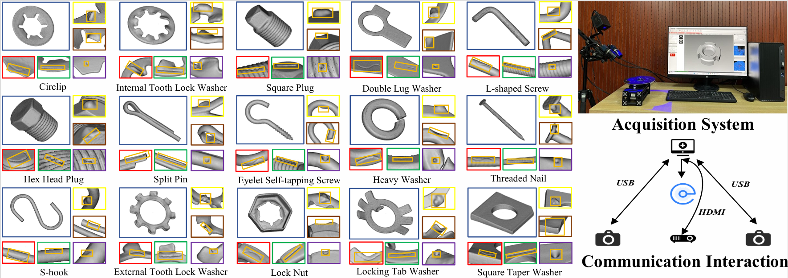

# Open-Set Supervised 3D Anomaly Detection

This repository accompanies our preprint:

**Open-Set Supervised 3D Anomaly Detection: An Industrial Dataset and a Generalisable Framework for Unknown Defects**
[arXiv:2604.01171](https://arxiv.org/abs/2604.01171)

We study **open-set supervised 3D anomaly detection** for industrial point clouds, where training data contains only a subset of defect types, while testing includes both **seen** and **unseen** defects. The goal is to evaluate how well supervised 3D anomaly detection methods generalize to unknown defect categories that are not observed during training.

At the current stage, this repository releases the **OpenIndustry** dataset and several **open-source baseline implementations**. Our full proposed method will be released in a later update.



---

## Repository Structure

```text
.
├── DRA_train.py                     # Training entry for DRA
├── DevNet_train.py                  # Training entry for DevNet
├── DRA_eval_p.py                    # DRA evaluation: sample-level and point-level AUC
├── DevNet_eval_p.py                 # DevNet evaluation: sample-level and point-level AUC
├── generate_table_all_metrics.py    # Aggregate evaluation logs into CSV / Excel tables
├── dataloaders/
│   ├── dataloader.py                # Unified dataloader builder
│   ├── utlis.py                     # Optional balanced batch sampler
│   └── datasets/
│       ├── base_dataset.py          # Base dataset class
│       ├── open_industry.py         # OpenIndustry dataset implementation
│       ├── anomaly_shapenet.py      # Anomaly-ShapeNet / Real3D-AD implementation
│       ├── transform.py             # Point cloud augmentations
│       └── untils.py                # Filename parsing and split utilities
└── model/
    ├── DRA.py                       # DRA model
    ├── DevNet.py                    # DevNet model
    ├── loss/
    │   ├── __init__.py
    │   ├── deviation_loss.py
    │   └── binary_focal_loss.py
    └── pointmae/
        ├── patchcore/               # PatchCore-style feature extraction wrapper
        ├── feature_extractors/      # FPFH, raw point, and point cloud feature extractors
        ├── M3DM/                    # Point-MAE / Point-BERT models, FPS, and KNN
        └── utils/                   # Visualization and preprocessing utilities
```

The repository also includes an `Open3DAD/` directory for the Open3DAD implementation.

---

## Installation

### Requirements

* Python >= 3.8
* PyTorch >= 1.12
* CUDA-compatible GPU is recommended
* open3d
* scikit-learn
* tqdm
* timm
* pandas
* openpyxl
* matplotlib
* tensorboard, optional for DRA logging
* pointnet2_ops, optional for CUDA-accelerated FPS; a CPU fallback is available

Install the main dependencies with:

```bash
pip install torch torchvision open3d scikit-learn tqdm timm pandas openpyxl matplotlib tensorboard
```

---

## Pretrained 3D Backbones

The framework supports **Point-MAE** and **Point-BERT** as point cloud backbones.

Please place the pretrained checkpoints under the paths expected by `model/pointmae/M3DM/models.py`:

```text
model/pointmae/point_mae_checkpoint/pretrain.pth      # Point-MAE
model/pointmae/point_mae_checkpoint/point_bert.pth    # Point-BERT
```

For the exact checkpoint loading logic, please refer to `Model1.__init__()` in:

```text
model/pointmae/M3DM/models.py
```

---

## Datasets

| Dataset                      | `--dataset` flag   | Description                                                                |
| ---------------------------- | ------------------ | -------------------------------------------------------------------------- |
| OpenIndustry                 | `open_industry`    | Industrial 3D anomaly detection dataset introduced in our work             |
| Anomaly-ShapeNet / Real3D-AD | `anomaly_shapenet` | Public 3D anomaly detection benchmarks supported by the unified dataloader |

---

## OpenIndustry Dataset

OpenIndustry is designed for **open-set supervised industrial 3D anomaly detection**. In this setting, only a subset of anomaly types is used as known defects during training, while the remaining anomaly types are held out for unseen-defect evaluation.

Typical defect categories include:

* Bump
* Deformation
* Dent
* Scar
* Scratch

The dataset can be downloaded from Hugging Face:

[https://huggingface.co/datasets/HanzheL/open-industry](https://huggingface.co/datasets/HanzheL/open-industry)

Expected directory layout:

```text
dataset_root/
└── classname/
    ├── train/          # Normal training samples, e.g., classname_001.pcd
    └── test/           # Normal and anomalous test samples, e.g., classname_Bump_001.pcd
```

---

## Anomaly-ShapeNet / Real3D-AD

The unified dataloader also supports Anomaly-ShapeNet / Real3D-AD-style datasets.

Typical anomaly categories include:

* bulge
* broken
* concavity
* crak
* scratch

Expected directory layout:

```text
dataset_root/
└── classname/
    ├── train/          # Normal training samples: *.pcd
    ├── test/
    │   └── good/       # Normal test samples: *.pcd
    └── GT/             # Point-level annotations: *.txt, formatted as x, y, z, label
```

---

## Included Baselines

### DRA

**DRA**, short for **Dual-head Reference-Augmented**, is a reference-set-based anomaly detection baseline. It uses multiple scoring heads to learn seen, pseudo, and composite anomaly patterns. The implementation also supports pseudo anomaly synthesis through local geometric perturbations.

### DevNet

**DevNet**, short for **Deviation Network**, is a single-head anomaly detection baseline trained with deviation loss. In this repository, DevNet follows a multiple-instance-learning-style scoring scheme for point cloud anomaly detection.

### Full Proposed Method

The full proposed method described in our paper is **not included in the current release**. It will be open-sourced in a later update.

---

## Key Arguments

| Argument               | Description                                                 | Default                     |
| ---------------------- | ----------------------------------------------------------- | --------------------------- |
| `--dataset`            | Dataset type: `open_industry` or `anomaly_shapenet`         | `open_industry`             |
| `--dataset_root`       | Path to dataset root                                        | Required                    |
| `--classname`          | Object class for training and evaluation                    | Required                    |
| `--know_class`         | Known anomaly types used during training                    | `None`                      |
| `--nAnomaly`           | Number of anomaly samples per known class used for training | `5`                         |
| `--xyz_backbone`       | 3D backbone: `Point_MAE` or `Point_BERT`                    | `Point_MAE`                 |
| `--use_pseudo_anomaly` | Whether to enable pseudo anomaly generation                 | `1` for DRA, `0` for DevNet |
| `--ramdn_seed`         | Random seed                                                 | `42`                        |
| `--nRef`               | Number of reference samples, DRA only                       | `5`                         |
| `--total_heads`        | Number of DRA scoring heads                                 | `4`                         |
| `--topk`               | Top-k ratio for MIL-style scoring                           | `0.1`                       |
| `--eval_ckpt`          | Checkpoint path for evaluation                              | Required for evaluation     |
| `--experiment_dir`     | Output directory                                            | `./experiment/`             |
| `--device`             | Device identifier                                           | `cuda:0`                    |

---

## Training

### Train DRA

```bash
python DRA_train.py \
  --dataset open_industry \
  --dataset_root /path/to/dataset \
  --classname bagel \
  --know_class Bump Dent \
  --nAnomaly 5 \
  --xyz_backbone Point_MAE \
  --device cuda:0
```

### Train DevNet

```bash
python DevNet_train.py \
  --dataset open_industry \
  --dataset_root /path/to/dataset \
  --classname bagel \
  --know_class Bump Dent \
  --nAnomaly 5 \
  --xyz_backbone Point_MAE \
  --device cuda:0
```

---

## Evaluation

### Evaluate DRA

```bash
python DRA_eval_p.py \
  --dataset open_industry \
  --dataset_root /path/to/dataset \
  --classname bagel \
  --eval_ckpt /path/to/checkpoint.pth \
  --device cuda:0
```

### Evaluate DevNet

```bash
python DevNet_eval_p.py \
  --dataset open_industry \
  --dataset_root /path/to/dataset \
  --classname bagel \
  --eval_ckpt /path/to/checkpoint.pth \
  --device cuda:0
```

---

## Evaluation Metrics

Both evaluation scripts report sample-level and point-level anomaly detection metrics.

### Sample-level metrics

* Overall ROC-AUC / PR-AUC
* Seen-only ROC-AUC / PR-AUC
* Unseen-only ROC-AUC / PR-AUC

### Point-level metrics

* Seen point-level ROC-AUC / PR-AUC
* Unseen point-level ROC-AUC / PR-AUC

Point-level localization is obtained by token-gradient nearest-neighbor interpolation.

Evaluation results are saved to:

```text
eval_results_all.xlsx
```

To aggregate results across experiments, run:

```bash
python generate_table_all_metrics.py
```

---

## Feature Caching

During the first run, the framework extracts Point-MAE or Point-BERT features and caches them as `.npz` files. Later runs automatically reuse cached features to reduce repeated backbone forwarding, lower GPU memory usage, and speed up training and evaluation.

Default cache locations:

* **OpenIndustry**: `OpenIndustry_<Backbone>_feature/`, stored parallel to the dataset directory.
* **Anomaly-ShapeNet / Real3D-AD**: stored alongside the dataset, with paths configurable in code.

---

## Open3DAD Implementation

This repository also includes an Open3DAD implementation under:

```text
Open3DAD/
```

For this implementation, OpenIndustry is exposed through the `open-industry` dataset argument. Some internal files and function names still use historical names, such as `mc3dad.py` and `mbc3dad_classes()`, for compatibility. The external running interface uses `open-industry`.

### Environment Setup

```bash
cd Open3DAD
conda env create -f environment.yml
conda activate open-industry
```

### Run with the Default Script

```bash
cd Open3DAD
bash run.sh
```

Before running, the main settings in `run.sh` are:

```bash
DATASETS=(open-industry)
KNOWN_DEFECTS[open-industry]="Bump Deformation"
CUDA_ID=0
thr=0
lam=0.1
```

Here, `pollution_per_defect` controls the number of anomalous samples used for each known defect type during open-set supervised training.

### Run a Single Open3DAD Experiment

```bash
python main.py \
  --dataset open-industry \
  --num_group 4096 \
  --group_size 128 \
  --max_nn 40 \
  --use_LFSA True \
  --use_MSND True \
  --expname open-industry_thr0_lam0.1_seed1 \
  --known_defects Bump Deformation \
  --pollution_per_defect 5 \
  --abnormal_ratio_threshold 0 \
  --lam 0.1 \
  --seed 1
```

Important Open3DAD arguments:

| Argument                     | Description                                         |
| ---------------------------- | --------------------------------------------------- |
| `--dataset`                  | Dataset name. Use `open-industry` for OpenIndustry. |
| `--known_defects`            | Defect types treated as known during training.      |
| `--pollution_per_defect`     | Number of anomalous samples per known defect.       |
| `--abnormal_ratio_threshold` | Abnormal ratio threshold.                           |
| `--lam`                      | Weighting coefficient used by the method.           |
| `--use_LFSA`                 | Enable LFSA module.                                 |
| `--use_MSND`                 | Enable MSND module.                                 |

Logs are saved under:

```text
Open3DAD/logs/
```

Separate log subdirectories are created for different random seeds.

---

## Additional Notes

* DRA training keeps the **top-5 checkpoints** according to the evaluation metric and removes lower-ranked checkpoints automatically.
* TensorBoard logging for DRA is saved under `<experiment_dir>/tensorboard/`.
* The pseudo anomaly pipeline uses `SphereCropMask` to generate local geometric perturbations, such as bump-like or dent-like structures.

---

## Citation

If you find this repository useful, please cite:

```bibtex
@misc{liang2026opensetsupervised3danomaly,
      title={Open-Set Supervised 3D Anomaly Detection: An Industrial Dataset and a Generalisable Framework for Unknown Defects},
      author={Hanzhe Liang and Luocheng Zhang and Junyang Xia and HanLiang Zhou and Bingyang Guo and Yingxi Xie and Can Gao and Ruiyun Yu and Jinbao Wang and Pan Li},
      year={2026},
      eprint={2604.01171},
      archivePrefix={arXiv},
      primaryClass={cs.CV},
      url={https://arxiv.org/abs/2604.01171},
}
```

---

## License

This project is released for academic research purposes under the MIT License.

```text
MIT License

Copyright (c) 2026 Hanzhe Liang (梁涵喆)

Permission is hereby granted, free of charge, to any person obtaining a copy
of this software and associated documentation files (the "Software"), to deal
in the Software without restriction, including without limitation the rights
to use, copy, modify, merge, publish, distribute, sublicense, and/or sell
copies of the Software, and to permit persons to whom the Software is
furnished to do so, subject to the following conditions:

The above copyright notice and this permission notice shall be included in all
copies or substantial portions of the Software.

THE SOFTWARE IS PROVIDED "AS IS", WITHOUT WARRANTY OF ANY KIND, EXPRESS OR
IMPLIED, INCLUDING BUT NOT LIMITED TO THE WARRANTIES OF MERCHANTABILITY,
FITNESS FOR A PARTICULAR PURPOSE AND NONINFRINGEMENT. IN NO EVENT SHALL THE
AUTHORS OR COPYRIGHT HOLDERS BE LIABLE FOR ANY CLAIM, DAMAGES OR OTHER
LIABILITY, WHETHER IN AN ACTION OF CONTRACT, TORT OR OTHERWISE, ARISING FROM,
OUT OF OR IN CONNECTION WITH THE SOFTWARE OR THE USE OR OTHER DEALINGS IN THE
SOFTWARE.
```
